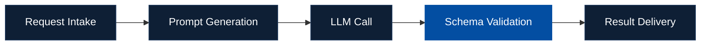

`MSoftech` `AI Solutions Engineering Lead` `U.S. Remote Ready`

# Min Jung Park

**We don't write code to spec. We decide what's worth building.**

Most engineers can build what you describe.
We figure out what you *should* be building — then build it.

  

---

### About MSoftech

MSoftech is a boutique AI engineering studio — a **senior-only team of two** that handles everything from domain analysis to production deployment. No layers between you and the engineers who build your system.

`AI Agent Orchestration` `End-to-End Delivery` `Domain-First Engineering` `Proven U.S. Remote`

---

### What We Do

🔹 **AI Agent Orchestration** — Multi-agent LLM pipelines in production, not demos. 14+ agents across healthcare, environmental science, and enterprise systems.

🔹 **Domain-First Engineering** — We absorb your industry before writing a line of code. Healthcare (FHIR R4), geological analysis, water quality, manufacturing quality — we've done it.

🔹 **End-to-End Delivery** — Architecture, development, deployment, documentation, handover. Your project keeps moving while you're offline.

🔹 **Proven U.S. Remote** — 3.5 years with Samsung SDS America. 100% text-based async collaboration across U.S. time zones.

---

### How We Approach a Project

We don't start with code — we start with your domain. Every engagement follows the same structured process, regardless of industry.

> *"Most engineers ask 'how should this be coded?' We ask 'how should this be designed?' — then code it ourselves."*

---

### Production Systems

| Project | What It Does | Stack |
|---|---|---|
| **Samsung SDS America** | IT Device Service Management System. 3.5-year fully remote engagement | `Full-Stack` · `U.S. EST` · `JIRA` · `Confluence` |
| **Clinical Nursing EMR** | AI nursing education platform. 6 agents, 55 evaluation criteria, 90% grading accuracy | `React 18` · `Spring Boot` · `Vertex AI` · `FHIR R4` |
| **FHIR EMR** | KR Core FHIR R4-compliant EMR. 7 resources, full clinical workflow | `React` · `FHIR R4` · `Spring Boot` · `HAPI FHIR` |
| **My Health Coach** | AI health management app. 5 chronic conditions, 4 agents, FHIR R4 backend | `Flutter` · `Multi-Provider AI` · `FHIR R4` |
| **AI AquaLab** | B2B water quality analysis. 4 agents, 56 inspection criteria, branding strategy reports | `React 18` · `Vertex AI` · `Spring Boot` · `PostgreSQL` |
| **AI Geological Analysis** | Hot spring feasibility assessment. AI grading (A+~D), 6-factor risk analysis, 1.5km depth | `React 18` · `Vertex AI` · `Spring Boot` · `KIGAM DB` |
| **Hydro Simulation Platform** | Integrated groundwater & hot spring simulation. 6 modules, 466 hot spring records, KDS compliance | `React 18` · `TypeScript` · `Spring Boot` · `Naver Maps` |

---

### Core Technology — AI Agent Orchestration Platform

Not just an LLM wrapper — a **production-grade agent lifecycle management platform** that enforces accuracy, consistency, and full observability across every AI agent, regardless of domain.

| | |
|---|---|
| **Agents in Production** | 14+ across 3 domains (Healthcare · Geological · Water Quality) |
| **Pipeline Stages** | 5-stage standardized pipeline |
| **Schema Validation** | 100% — AI output always matches predefined JSON Schema |
| **LLM Providers** | Google Gemini + OpenAI GPT — runtime-selectable, unified interface |

### 5-Stage Core Pipeline

Every agent — whether it analyzes nursing performance or evaluates geological risk — runs through the same pipeline:

① **Request Intake** — Client sends data + request context

② **Prompt Generation** — Registry lookup → Template retrieval → Live data injection into placeholders

③ **LLM Call** — Multi-provider routing (Gemini / GPT), runtime-selectable without code changes

④ **Schema Validation** — JSON Schema draft-07 enforcement. Required fields, type validation, `$ref`/`$defs` component reuse. Failed outputs never reach the client

⑤ **Result Delivery** — Validated, schema-compliant data mapped to DTO → client application

### 3-Artifact Architecture

The platform solves the gap between what LLMs produce (free-form text) and what applications need (structured JSON):

| Artifact | Role |
|---|---|
| **Prompt Registry** | Agent directory — maps each agent to its Template + Schema, manages versioning. CI/CD managed, rollback at any time |
| **Prompt Template** | Agent behavioral spec — strict 5-section format: `MISSION → CONTEXT → RULES → Analysis Guidelines → DATA & FORMAT`. Placeholders receive live data at runtime |
| **Output Schema** | Contract for AI output — JSON Schema draft-07 with `$ref`/`$defs` for component reuse. Guarantees structural consistency across all agents |

### Live Broadcast Mode

Every pipeline stage is streamed in real time — showing exactly which prompt template was used, how data was injected, what the LLM received, and whether the output passed schema validation. AI behavior is fully traceable and auditable.

---

### Open to Collaboration

We engage in **fixed-scope projects**, **monthly retainers**, and **full-time remote contracts**.
All engagements start with an NDA. Either party can exit with 30 days' notice.
