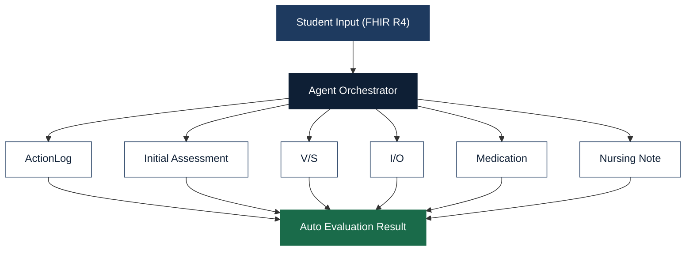

`MSoftech` `AI Solutions Engineering Lead` `U.S. Remote Ready`

# Min Jung Park

**We don't write code to spec. We decide what's worth building.**

Most engineers can build what you describe.
We figure out what you *should* be building — then build it.

 

---

### About MSoftech

MSoftech is a boutique AI engineering studio — a **senior-only team of two** that handles everything from domain analysis to production deployment. No layers between you and the engineers who build your system.

`AI Agent Orchestration` `End-to-End Delivery` `Domain-First Engineering` `Proven U.S. Remote`

---

### What We Do

🔹 **AI Agent Orchestration** — Multi-agent LLM pipelines in production, not demos. 14+ agents across healthcare, environmental science, and enterprise systems.

🔹 **Domain-First Engineering** — We absorb your industry before writing a line of code. Healthcare (FHIR R4), geological analysis, manufacturing quality — we've done it.

🔹 **End-to-End Delivery** — Architecture, development, deployment, documentation, handover. Your project keeps moving while you're offline.

🔹 **Proven U.S. Remote** — 3.5 years with Samsung SDS America. 100% text-based async collaboration across U.S. time zones.

---

### How We Approach a Project

We don't start with code — we start with your domain. Every engagement follows the same structured process, regardless of industry.

> *"Most engineers ask 'how should this be coded?' We ask 'how should this be designed?' — then code it ourselves."*

---

### Production Systems

| Project | What It Does | Stack |
|---|---|---|
| **Clinical Nursing EMR** | AI nursing education platform. 6 agents, 55 criteria, 90% accuracy | `React 18` · `Spring Boot` · `Vertex AI` · `FHIR R4` |
| **FHIR EMR** | Complete KR Core FHIR R4-based EMR. 7 resources, full clinical workflow | `React` · `FHIR R4` · `Spring Boot` · `HAPI FHIR` |
| **My Health Coach** | AI health app. 5 chronic conditions, 4 agents, 22 prompt templates | `Flutter` · `GPT-4` · `Gemini` · `FHIR R4` |
| **AI AquaLab** | Groundwater quality analysis. 4 agents, 56 criteria | `React 18` · `Vertex AI` · `Spring Boot` · `PostgreSQL` |
| **Samsung SDS America** | IT Service Management System. 3.5-year remote engagement | `Full-Stack` · `U.S. EST` · `3.5 Years` |

---

### Core Technology — AI Agent Orchestration Platform

A production-grade pipeline built from scratch — not a wrapper around existing tools.

`Prompt Registry` · `Schema Validation` · `Multi-Provider LLM` · `Agent Ops Logging` · `FHIR R4 Persistence`

Google Gemini 2.5 + OpenAI GPT-4 — runtime-selectable, unified interface.

**Clinical Nursing EMR — 6-Agent Evaluation Architecture:**

---

### Open to Collaboration

We engage in **fixed-scope projects**, **monthly retainers**, and **full-time remote contracts**.
All engagements start with an NDA. Either party can exit with 30 days' notice.
